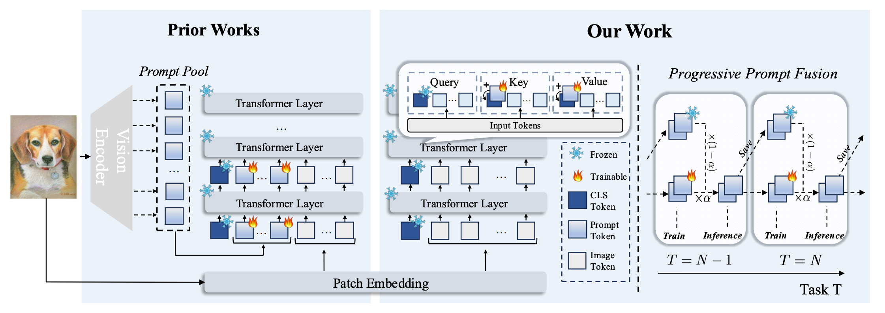

# ICCV 2025 - Achieving More with Less: Additive Prompt Tuning for Rehearsal-Free Class-Incremental Learning

**Paper Link**: [`Arxiv`](https://arxiv.org/pdf/2503.07979v2) **Authors**: [Haoran Chen](https://haoranchen.github.io/), Ping Wang, Zihan Zhou, Xu Zhang, [Zuxuan Wu](https://zxwu.azurewebsites.net/),  [Yu-Gang Jiang](https://scholar.google.com/citations?user=f3_FP8AAAAAJ&hl=en)


## Overview
<p align="center">
  
<be>
</p>

## Abstract
Class-incremental learning (CIL) enables models to learn new classes progressively while preserving knowledge of previously learned ones. Recent advances in this field have shifted towards parameter-efficient fine-tuning techniques, with many approaches building upon the framework that maintains a pool of learnable prompts. Although effective, these methods introduce substantial computational overhead, primarily due to prompt pool querying and increased input sequence lengths from prompt concatenation. In this work, we present a novel prompt-based approach that addresses this limitation. Our method trains a single set of shared prompts across all tasks and, rather than concatenating prompts to the input, directly modifies the CLS token's attention computation by adding the prompts to it. This simple and lightweight design not only significantly reduces computational complexity-both in terms of inference costs and the number of trainable parameters-but also eliminates the need to optimize prompt lengths for different downstream tasks, offering a more efficient yet powerful solution for rehearsal-free class-incremental learning. Extensive experiments across a diverse range of CIL benchmarks demonstrate the effectiveness of our approach, highlighting its potential to establish a new prompt-based CIL paradigm. Furthermore, experiments on general recognition benchmarks beyond the CIL setting also show strong performance, positioning our method as a promising candidate for a general parameter-efficient fine-tuning approach.

## Dependencies
1. torch==2.4.1
2. torchvision==0.19.1
3. timm==0.4.12

## Datasets
Download the following datasets and put them under ./data

1. **Cifar100** - should automatically be downloaded
2. [**Imagenet-R**](https://github.com/hendrycks/imagenet-r)
3. [**CUB200**](https://drive.google.com/file/d/15u8H-0V27tHnLXVaCUl64u4RGSosMTJi/view)
4. [**StanfordCars**](https://drive.google.com/file/d/1OWi9oToj5S4qf8yQqcskYURGejOyuvkS/view?usp=drive_link)

## How to use
```bash
bash experiments/cifar100.sh
bash experiments/imagenet-r.sh
bash experiments/cub200.sh
bash experiments/stanfordcars.sh
```

## Acknowledgments

We thank the [Coda-Prompt](https://github.com/GT-RIPL/CODA-Prompt) repo for providing helpful codebase in our work.

## Contact
Feel free to contact us if you have any questions or suggestions 
Email: chenhran21@m.fudan.edu.cn

## Citation
If you use our code in this repo or find our work helpful, please consider giving a citation:

```
@article{chen2025achieving,
  title={Achieving More with Less: Additive Prompt Tuning for Rehearsal-Free Class-Incremental Learning},
  author={Chen, Haoran and Wang, Ping and Zhou, Zihan and Zhang, Xu and Wu, Zuxuan and Jiang, Yu-Gang},
  booktitle={ICCV 2025},
  year={2025}
}
```
